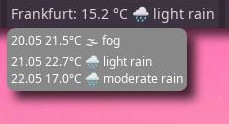

# qtile-widget-openmeteo
A widget for the Qtile windowmanager to display weather data and a simple forecast from openmeteo.com.
    
Place the file openmeteo.py in your .config/qtile directory and add the following to you config.py:
        
    import openmeteo
    ...
        
    widgets_list = [
    ...
    ...
    ...
    # openmeteo weather widget
    openmeteo.OpenMeteo( foreground='#dfdfdf', background='#000000', lat=50.1109, lon=8.6821, 
                         location='Frankfurt am Main', metric=True, tooltip_fontsize=12, 
                         update_interval=600, language='de' ),
    ...
    ...
    ...
    ]
        
See defaults in openmeteo.py for a list of parameters.
update_interval is in seconds, if you leave language unset it defaults to english.

# Screenshots

